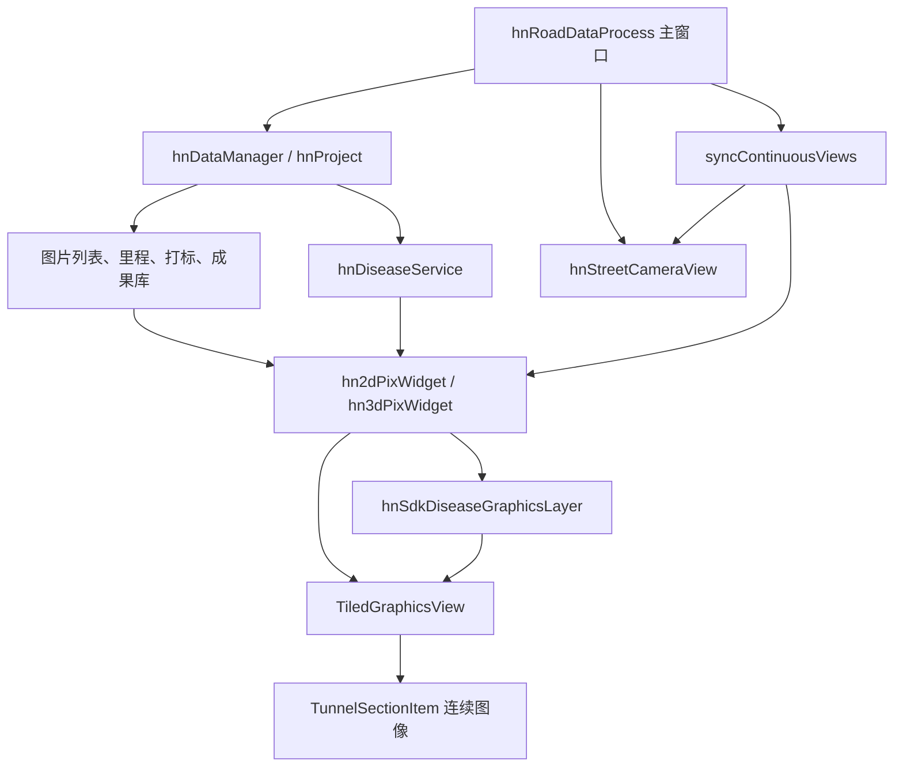
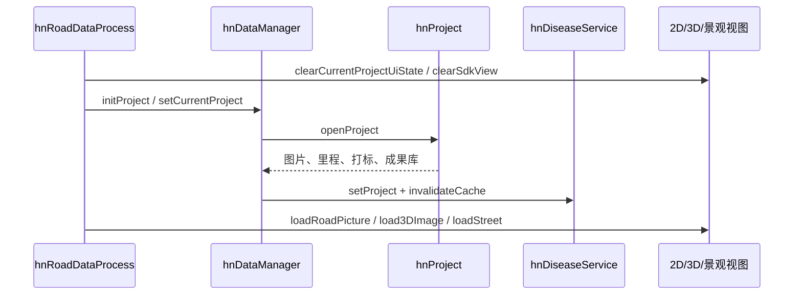
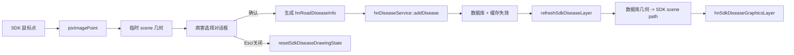

# hnRoadDataProcess

`hnRoadDataProcess` 是 Windows + C++ + Qt 的公路二维、三维、景观影像内业处理软件，覆盖工程导入、连续影像浏览、2D/3D 联动、病害绘制与管理、路面打标、里程校准、地图和成果输出。

本文重点说明当前 SDK 视图架构和病害链路。SDK 自身接口见 [TunnelViewerSDK_V1.1.1/README.md](TunnelViewerSDK_V1.1.1/README.md)，迁移过程和历史验证记录见 [docs/sdk_migration_task_handoff.md](docs/sdk_migration_task_handoff.md)。

## 1. 当前架构结论

当前系统已经进入 SDK 视图迁移后的混合架构：

- 2D/3D 图像显示由 `TiledGraphicsView` 和 `TunnelSectionItem` 负责。
- 正式病害、临时病害、选中高亮、标签引线和材质标识由应用层 `hnSdkDiseaseGraphicsLayer` 加入同一个 SDK scene。
- `hnBrowsePixWidget` 及旧 `paintEvent()` 仍保留，主要承载旧浏览状态、旧坐标/校验/入库兼容逻辑和非 SDK 路径；SDK 模式下不应再由它绘制正式图像与正式病害。
- 业务数据库仍使用原有 `hnRoadDiseaseInfo`、`vec2dRect`、`vec3dRect` 和病害表结构。
- 病害增删改查统一经过 `hnDiseaseService`，SDK 图层不直接操作数据库。
- 2D/3D/景观联动统一进入 `hnRoadDataProcess::syncContinuousViews()`。



## 2. 主要模块

| 目录 | 当前职责 |
| --- | --- |
| `hnRoadDataProcess/` | 主程序、Ribbon、dock 编排、工程切换、2D/3D/景观联动、病害列表、地图和输出。 |
| `hnApplication/` | 2D/3D 业务视图、SDK 适配层、病害绘制状态机、病害 scene 图层和病害服务。 |
| `SDK/` | 通用连续影像视图、图片数据源、坐标转换、缓存、LOD 和网格选择。 |
| `hnProject/` | 2D/3D 工程解析、图片列表、编码器里程、真实桩号、打标、成果库和 2D/3D 差值。 |
| `hnContinuousBrowsePix/` | 旧连续浏览控件。当前仍是 2D/3D 业务 widget 的继承基础，但不再是 SDK 模式的主显示层。 |
| `hnDataTable/` | SQLite 数据表封装。 |
| `hnCommon/` | 工程、里程、病害等公共数据结构。 |
| `hnConfigService/` | 软件设置和视图配置。 |
| `hd*` | 点云和三维底层模块。 |

## 3. 推荐阅读顺序

1. `hnRoadDataProcess/hnRoadDataProcess.cpp`
   先看 dock 创建、工程打开、信号连接和 `syncContinuousViews()`。
2. `hnApplication/hn2d3dPixBaseWidget.h/.cpp`
   这是 SDK 视图适配、绘制状态机、里程定位、正式病害刷新和打标显示的中心。
3. `hnApplication/hn2dPixWidget.cpp`、`hn3dPixWidget.cpp`
   分别负责 2D/3D 数据库几何生成、读取和 scene path 转换。
4. `hnApplication/hnSdkDiseaseGraphicsLayer.h/.cpp`
   看正式病害、临时预览、选中、标签引线和材质边界如何加入 scene。
5. `hnApplication/hnDiseaseService.h/.cpp`
   看病害数据库访问、缓存失效和刷新信号。
6. `TunnelViewerSDK_V1.1.1/src/TiledGraphicsView.*`、`TunnelSectionItem.*`
   看连续布局、坐标转换、滚动缩放和图片加载。
7. `TunnelViewerSDK_V1.1.1/include/tools/GridSelectionTool.h`、`TunnelViewerSDK_V1.1.1/src/GridSelectionTool.cpp`
   看小框点选、矩形选格和折线 supercover 逻辑。

## 4. 工程打开与卸载

工程核心对象是 `hnPro::hnProject`，全局入口是 `hnApp::hnDataManager`。



切换或重新导入工程时，旧工程的以下状态必须一起清空：

- 2D/3D SDK scene、图片、病害、临时绘制和选中项。
- 景观图片。
- 病害列表。
- 工程信息、采集打标列表和校桩列表。
- 地图数据和状态栏。

不能只清工程树或病害列表，否则新工程未双击前会残留旧视图。

## 5. 当前视图所有权

### 5.1 2D/3D 图像

`hn2d3dPixBaseWidget::loadSdkVerticalImageSequence()` 创建：

- `TiledGraphicsView`
- `TunnelViewerController`
- `WholeImageSourceFactory(LayoutOrientation::VerticalReverse, ...)`

工程图片顺序由项目层确定后传给 `TunnelViewerController::loadImages()`。当前路线使用反向纵向 scene：第一张图片在底部，编码器里程增大时 sceneY 减小。

SDK 模式下：

- 图片由 `TunnelSectionItem::paint()` 绘制。
- 普通滚轮移动视图。
- `Ctrl+滚轮` 修改 view transform。
- 病害框跟随 scene 变换，不应再由 QWidget overlay 以屏幕坐标重画。

旧 `hnBrowsePixWidget::paintEvent()` 仍用于非 SDK 兼容路径。新增 SDK 功能不应再依赖它生成临时拼接大图。

### 5.2 景观图

景观图由 `hnStreetCameraView` 显示单张图片，不连续拼接。它按当前 2D 编码器里程选择对应景观图片；翻页后通过统一联动入口反向定位 2D/3D。

状态栏中的景观图片名由当前实际显示图片更新，不跟随鼠标在路面图上的位置变化。

## 6. 坐标和里程

### 6.1 SDK 坐标

| 坐标 | 含义 |
| --- | --- |
| viewport 坐标 | 鼠标在 SDK viewport 中的位置。 |
| scene 坐标 | 整条连续路线的全局图形坐标。 |
| 单图坐标 | 当前原始图片内的像素坐标。 |
| `pixImagePoint` | `pixName + pixPoint`，当前 SDK 病害交互的基础点。 |

转换入口：

- `sdkScenePointToPixPoint()`：scene 点转 `pixImagePoint`。
- `sdkPixPointToScenePoint()`：`pixImagePoint` 转 scene 点。
- `TiledGraphicsView::mapToGlobalScene()`：图片名和单图像素转 scene。
- `TiledGraphicsView::GlobalSceneToMap()`：scene 反查图片名和单图像素。

### 6.2 连续编码器里程

对单图高度 `H`、每张图对应里程 `D`、帧号 `frameIdx` 和单图 y：

```text
imageBeginMile = (frameIdx - 1) * D
offsetInImage  = (H - localY) * D / H
encoderMile    = imageBeginMile + offsetInImage
```

当前 scene 使用 `VerticalReverse`，因此编码器里程与 sceneY 的转换不能套用正向纵向布局。统一使用：

- `encoderMileToSdkSceneY()`
- `sdkSceneYToEncoderMile()`
- `sdkPixPointToEncoderMile()`
- `sdkAnchorToEncoderMile()`

### 6.3 真实桩号

真实桩号和编码器里程通过 `hnProject::enclToTrueMile()` / `trueMileToEncl()` 转换。显示桩号、打标跳转和景观图定位不能把两者混用。

### 6.4 2D/3D 差值

`2D3D_DIFF` 表示编码器里程差值，不是像素差：

```text
target3D = source2D - diff
target2D = source3D + diff
```

当前联动基准是视图底部编码器里程。目标视图与目标值相差小于 `0.01m` 时不再滚动，以避免 2D/3D 来回追赶。

## 7. 2D/3D/景观联动

唯一跨视图入口是：

```cpp
hnRoadDataProcess::syncContinuousViews(
    ContinuousViewSyncSource source,
    double sourceEncoderMile);
```

规则：

| 来源 | 2D 目标 | 3D 目标 | 景观图目标 |
| --- | --- | --- | --- |
| 2D | 当前值 | `2D - diff` | 2D 里程 |
| 3D | `3D + diff` | 当前值 | 目标 2D 里程 |
| 景观图 | 景观对应 2D 里程 | `2D - diff` | 当前图片 |

只有 `signal_sdkUserBottomEncoderMileChanged` 触发跨视图同步。普通 `signal_sdkBottomEncoderMileChanged` 只更新状态栏、旧状态和外层控件，防止程序定位再次反向触发同步。

所有用户入口都应最终进入同一方法：滚轮、W/S、方向键、滚动条拖动、病害列表定位、里程跳转、打标跳转和景观图翻页。

## 8. 病害数据与唯一键

### 8.1 数据服务

病害读写统一走 `hnDiseaseService`：

- `getRoadDiseasesInRange()`
- `addDisease()`
- `updateDisease()`
- `deleteOneDisease()`
- `invalidateCache()`

数据库写入成功后必须失效或正确更新全量病害缓存，再发出 `diseaseChanged()`。不要从 UI 或 SDK 图层绕过服务直接写表。

### 8.2 唯一键

病害 ID 只在单张数据库表内唯一。应用层 scene key 使用：

```text
<tableName>#<diseaseId>
```

例如 `DisPSB#162`。选中、命中、删除、缓存和列表联动都应使用该组合 key，不能只比较 `nID`。

## 9. 病害绘制链路

### 9.1 通用流程



确认入库后，新增病害应自动成为 2D/3D 共同选中项。取消对话框只取消当前一笔，保留添加模式，但在下一次左键前鼠标移动不得继续生成病害。

### 9.2 大框和设计模式

SDK 交互点应以 `pixImagePoint` 或 scene 几何为真相源。提交时转换一次写入原数据库结构。正式显示再从数据库几何转换回 scene。

尚未完全迁移的线状兼容路径仍可能调用旧大图点转换；新增逻辑不应继续扩大这部分依赖。

### 9.3 小框模式

小框数据库格式不变：

- 2D：`vec2dRect`
- 3D：`vec3dRect`
- `nDrawType == 1`
- 面积按格子数量乘以单格面积计算。

当前交互：

- 普通轨迹模式：左键开始，移动记录轨迹，再次左键结束。
- `R`：矩形选择。绘制阶段只显示大矩形，确认前再生成最终格子。
- `B`：折线选择。左键增加折线点，右键或结束键提交，确认前用 supercover 补齐线段经过格子。
- `D`：保留给 SDK 向右浏览，不再切换小框模式。

绘制阶段避免把几千个格子逐个加入 scene。正式显示分为：

- `DenseRect`：密集矩形小框只显示外接矩形。
- `SparseCells`：折线/轨迹小框显示合并后的稀疏格子路径。

删除模式不依赖 scene 是否逐格显示：左键用 `imageName + 单图像素` 命中并删除一个数据库格子，右键删除完整病害。

## 10. 正式病害显示

正式病害唯一刷新入口是：

```cpp
hn2d3dPixBaseWidget::refreshSdkDiseaseLayer();
```

主要调用链：

```text
refreshSdkDiseaseLayer
  -> clearSdkLittleFrameRenderCache
  -> refreshSdkDiseaseItems
  -> hnDiseaseService::getRoadDiseasesInRange
  -> addSdkDiseaseItem
  -> hn2dPixWidget/hn3dPixWidget::sdkDiseaseScenePath
  -> hnSdkDiseaseGraphicsLayer::addDiseasePath
```

`m_sdkLittleFrameRenderCache` 只缓存已经成功生成的 scene path：

- 第一次刷新时为空是正常现象。
- 缓存未命中后必须现场生成 path。
- 只有非空 path 才写入缓存。
- 新增、删除、修改、翻转或重新加载后必须清缓存。
- 缓存为空不是数据库病害不显示的直接原因，真正要检查的是 path 为什么没有生成。

选中状态只改变颜色，保持未选中状态的线型和线宽。选中 key 在 2D/3D 间同步。

## 11. 路面打标与跨材质限制

打标来自当前工程 `getCurrentMarkVector()`。SDK 图层使用固定 sceneY 的横向边界线、半透明色带、标签和箭头显示打标位置；标签必须随道路 scene 一起滚动，不能固定在 viewport 边缘。

双击打标列表时优先使用行内保存的原始编码器里程，其次按 `markId` 回查工程打标，最后才从真实桩号反算。

提交病害前，`temporaryDiseaseEncoderMileRange()` 计算临时几何覆盖的编码器里程范围，`isTmpDiseaseRoadMarkRangeValid()` 检查范围内材质、标准和等级。跨不兼容材质/标准的病害不允许入库。

## 12. 图片缓存

SDK 单图模式复用现有异步加载体系，但不全量常驻工程图片：

- 缩略图进入 `AsyncImageLoader::m_thumbnailCache`，上限约 500 MB。
- 数据库切片高清进入 `m_cache`，上限约 1000 MB。
- 普通单图高清主要保存在 `TunnelSectionItem::m_loadedTiles`，不再重复放入全局高清缓存。
- 当前视口附近提前加载，远离滑动窗口后释放。

因此进程内存不只来自两个 `QCache`，还包括当前 item 的高清 QPixmap、scene item、OpenCV/点云、数据库缓存和 Qt 图形资源。判断内存问题时应分别观察这些层，而不是只调整 QCache 上限。

## 13. 当前已知问题：数据库有小框，scene path 为空

2026-07-10 至 2026-07-14 的当前阻塞案例：

```text
[HN_SDK_DISEASE_RENDER_ATTEMPT]
key=DisPSB#162
drawType=1
pathEmpty=true
vec2d=59
vec3d=59
dDmi=890
dMileage=894.3
range=879.662 895.662
```

这个日志已经证明：

- 病害已进入数据库和病害服务查询结果。
- 当前查询范围包含病害。
- 2D/3D 几何都不为空。
- 失败点位于 `sdkDiseaseScenePath()` 的“数据库单图点 -> SDK scene 点”阶段。
- `m_sdkLittleFrameRenderCache` 为空只是首次缓存未命中，不是根因。

排查顺序：

1. 在 `hn2dPixWidget::sdkDiseaseScenePath()` 的 `pointToScene` 中检查每个点的 `m_dmi/x/y`。
2. 检查 `resolve2dDiseaseImageNameByMile()` 返回的图片名和帧号。
3. 确认该图片名存在于 `TiledGraphicsView::m_items` 的 `getImageName()`。
4. 检查 `mapToGlobalScene()` 是否真实命中 item；不能把 `(0,0)` 兜底当成功。
5. 检查四个 scene 点是否被映射成同一点，导致 `QRectF` 宽或高为 0。
6. 只有生成有效 `QPainterPath` 后才检查 `hnSdkDiseaseGraphicsLayer` 的可见性和样式。

相关日志：

- `HN_SDK_DISEASE_REFRESH`：查询范围和病害数量。
- `HN_SDK_DISEASE_ENSURE`：指定病害进入强制刷新。
- `HN_SDK_DISEASE_RENDER_ATTEMPT`：数据库几何和最终 path 状态。
- `HN_SDK_DISEASE_2D_POINT_FAIL`：2D 点无法解析图片。
- `HN_SDK_DISEASE_RENDER_SKIP`：空 path 被跳过。

## 14. 构建与验证

推荐使用 VS2022 MSBuild：

```powershell
$msbuild = "C:\Program Files\Microsoft Visual Studio\2022\Professional\MSBuild\Current\Bin\MSBuild.exe"

& $msbuild hnRoadDataProcess.sln /t:TunnelViewerSDK `
  /p:Configuration=Debug /p:Platform=x64 /m /v:minimal

& $msbuild hnRoadDataProcess.sln /t:hnApplication `
  /p:Configuration=Debug /p:Platform=x64 /m /v:minimal

& $msbuild hnRoadDataProcess.sln /t:hnRoadDataProcess `
  /p:Configuration=Debug /p:Platform=x64 /m:1 /nr:false /v:minimal
```

主程序或 DLL 正在运行时可能出现 `LNK1104`。关闭 `hnRoadDataProcess.exe` 后再链接。老工程还可能遇到 `.sbr`、PDB 或编码页 warning；不要在修业务问题时顺手清理无关构建产物。

手工验证至少覆盖：

- 2D/3D 普通滚轮、W/S、方向键和滚动条联动。
- `Ctrl+滚轮` 缩放时图像和病害几何一致变换。
- 景观图翻页反向同步。
- 大框、小框 R、小框 B、设计面、设计线的确认与取消。
- 新增后自动选中，删除后立即消失。
- 2D/3D 同一病害同步选中。
- 打标跳转、固定 scene 位置和跨材质禁止。
- 长距离滚动内存不无限增长。

## 15. 开发约束

- SDK 单图坐标和 scene 坐标是新交互的真相源；不要在新增 SDK 绘制中重新引入旧临时大图坐标。
- 数据库结构暂不改，只在提交和读取边界转换一次。
- SDK 核心保持通用，业务 key、表名、病害属性和材质规则留在 `hnApplication`。
- 任何病害增删改后主动调用统一刷新入口，不依赖滚动触发。
- 2D/3D 跨视图同步只响应用户 bottom 信号，程序定位必须有回环保护。
- 源码混有本地编码。编辑 GBK 文件时必须保留原编码；新 Markdown 文档统一 UTF-8。
- 工作区长期包含大量未提交修改，禁止通过 `git checkout --`、`git reset --hard` 等方式覆盖既有工作。

## 16. 后续清理边界

当前阶段应先保证 SDK 显示和病害闭环正确，再删除旧代码：

1. 修通数据库病害到 scene path 的稳定转换。
2. 完成大框、小框和设计模式 2D/3D 验收。
3. 确认 SDK 模式不再调用旧正式绘制。
4. 给仍被非 SDK 路径使用的旧函数标注“旧浏览路径专用”。
5. 删除无调用的旧滚动条、overlay 和重复联动槽。

不要为了“看起来干净”提前删除仍被坐标校验、属性计算、数据库转换或旧项目入口调用的函数。
