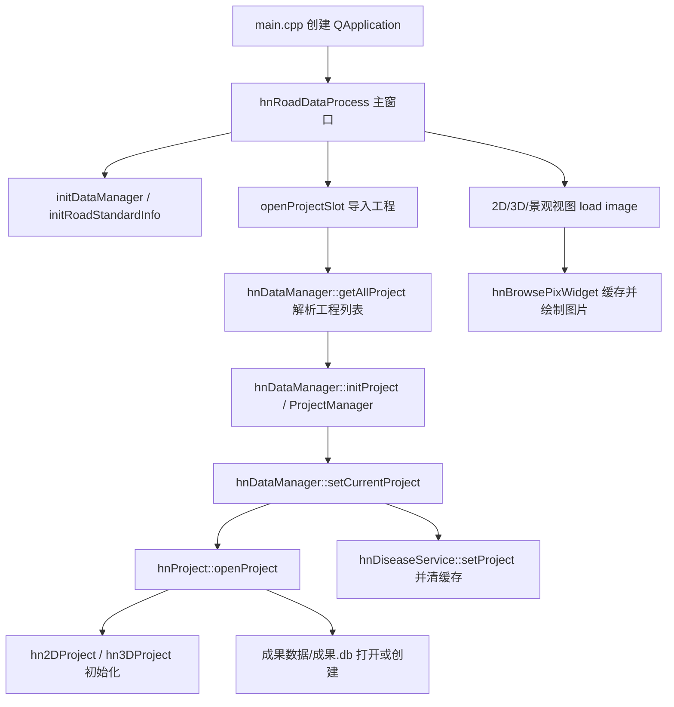

# hnRoadDataProcess 项目快速上下文

> 生成时间：2026-05-22  
> 用途：给 ChatGPT / Codex 快速理解项目，减少后续阅读 token。  
> 当前文档基于快速浏览源码形成，重点覆盖 `hnApplication`（图像显示界面与缓存）、`hnProject`、`hnRoadDataProcess`。

## 一句话概览

这是一个 Windows + Visual Studio C++ / Qt 的公路路面数据内业处理软件。主程序 `hnRoadDataProcess` 负责 Ribbon 主界面、工程导入、功能动作和各视图停靠；`hnApplication` 提供 2D/3D/景观图像浏览、病害绘制与数据服务；`hnProject` 负责解析二维/三维工程目录、成果库、里程桩/打标/图片路径/2D-3D 映射等工程上下文。

核心业务对象是 `hnPro::hnProject`。界面和图像控件大多通过 `hnApp::hnDataManager::getDataManager()->getCurrentProject()` 获取当前工程，再读取图片、里程、病害数据库、路面标准等信息。

## 推荐优先阅读文件

### 主程序与界面编排

| 文件 | 作用 |
| --- | --- |
| `hnRoadDataProcess/main.cpp` | Qt 应用入口，设置 DPI、日志、QSS，创建主窗口。 |
| `hnRoadDataProcess/hnRoadDataProcess.h/.cpp` | 主窗口。创建 2D/3D/景观/病害列表/项目属性等 dock；连接菜单动作和各视图信号；打开工程后触发图像加载。 |
| `hnRoadDataProcess/projectView.*` | 工程属性、打标、里程桩等项目侧栏。 |
| `hnRoadDataProcess/hnDiseaseListWidget.*` | 病害列表与图像视图的选中联动。 |
| `hnRoadDataProcess/adjustImageWidget.*` | 图像亮度/对比度控制面板，通过信号控制 2D/3D 视图。 |

### 应用层、图像显示与缓存

| 文件 | 作用 |
| --- | --- |
| `hnApplication/hnApplication.h/.cpp` | 应用层单例，创建 2D/3D 图像滚动控件和 3D 点云视图；点云显示使用 `hdPointCloud/PointCloudCache`。 |
| `hnApplication/hnDataManager.h/.cpp` | 全局数据管理单例：工程管理、当前工程、道路规范参数、点云数据、病害服务。 |
| `hnApplication/hnDiseaseService.h/.cpp` | 病害服务与病害缓存。维护全量病害缓存，提供按里程范围过滤、增删改时增量更新/失效。 |
| `hnApplication/hn2dPixScrollWidget.*` | 2D 路面图像滚动容器，包装 `hn2dPixWidget`，负责滚动条、跳转、键盘浏览。 |
| `hnApplication/hn3dPixScrollWidget.*` | 3D 影像滚动容器，包装 `hn3dPixWidget`，负责灰度/深度图浏览。 |
| `hnApplication/hn2dPixWidget.*` | 2D 路面图像显示、病害绘制、里程/坐标换算、2D 到 3D 病害映射。 |
| `hnApplication/hn3dPixWidget.*` | 3D 灰度/深度影像显示、控制点、三维坐标换算、3D 到 2D 病害映射。 |
| `hnApplication/hn2d3dPixBaseWidget.*` | 2D/3D 图像控件的共同基类：绘制模式、线状病害、小框自动化绘制、翻页续画、临时状态缓存。 |
| `hnApplication/hnStreetCameraView.*` | 景观图像单侧视图，使用 `QPixmap` 显示景观照片和景观病害。 |
| `hnContinuousBrowsePix/hnBrowsePixWidget.*` | 连续浏览图像的底层控件，真正实现图片拼接显示、坐标转换、图像缓存和预加载。 |
| `hnContinuousBrowsePix/imageLoader.*` | 扫描图片文件或接收图片路径列表，生成帧号到图片路径的映射。 |
| `hnContinuousBrowsePix/hnContinuouslyBrowsePixWidget.*` | 滚动条、播放、缩放/原图窗口等浏览容器逻辑。 |

### 工程解析与里程模型

| 文件 | 作用 |
| --- | --- |
| `hnProject/hnProject.h/.cpp` | 当前工程总模型：打开工程、判断 2D/3D/23D 类型、成果库创建/迁移、里程桩/打标、图片路径、2D-3D 里程差。 |
| `hnProject/hn2DProject.h/.cpp` | 二维工程：解析 `Setting.ini`、`ProjectInfo.txt`、`RoadImg`/`StreetImg` 图片路径、GPS、打标、里程桩、镜像配置。 |
| `hnProject/hn3DProject.h/.cpp` | 三维工程：解析点云 `.cam`、`Pavement-cam-1.idx`、灰度/深度图路径，提供图像名、GPS 时间、三维坐标映射。 |
| `hnProject/hnProjectManager.*` | 多工程管理，当前工程切换。 |
| `hnProject/hnFileFun.*` | 图片名和里程文本之间的辅助转换。 |

## 主要目录职责

| 目录 | 说明 |
| --- | --- |
| `hnRoadDataProcess/` | 主可执行程序 UI、菜单动作、报表/DXF/Excel/IRM/控制点/工程配置等上层业务。 |
| `hnApplication/` | 可复用业务应用层：图像视图、病害绘制、病害服务、全局数据管理、点云视图接入。 |
| `hnProject/` | 工程模型层：读取/维护工程路径、成果库、里程、打标、图像列表、2D/3D 映射。 |
| `hnContinuousBrowsePix/` | 连续图片浏览控件库，是 2D/3D 路面图像显示与图片缓存的底层。 |
| `hnDataTable/` | SQLite 数据表封装，病害、工程设置、控制点、打标、里程桩等读写。 |
| `hnCommon/` | 公共结构体/枚举/道路和病害数据结构。 |
| `hnQtCommon/` | Qt 公共工具、枚举、异常、文本/文件辅助。 |
| `hnConfigService/` | 全局配置读取，例如 `HnXRSettings`。 |
| `hd*` 目录 | 3D 引擎、点云、场景、HLS/HLZ 数据等底层能力。 |
| `3rd/` | 第三方依赖，通常不需要让 ChatGPT 阅读。 |
| `x64/`、`Debug/`、`bin/`、`obj-x64/`、`.vs/`、`ipch/` | 构建产物或 IDE 缓存，通常跳过。 |

## 核心运行流程



打开工程的大致路径：

1. `hnRoadDataProcess::openProjectSlot()` 让用户选择/配置工程。
2. `hnDataManager::getAllProject()` 查找 `ProjectInfo.xml` 或 `ProjectInfo.txt`，判断工作类型。
3. `hnDataManager::initProject()` 创建 `hnProjectManager` 并加入工程。
4. `hnDataManager::setCurrentProject()` 切换当前工程，设置 `hnDiseaseService` 项目指针，并按需加载点云。
5. `hnProject::openProject()` 判断 2D/3D/23D 类型，创建成果库，初始化 `hn2DProject` / `hn3DProject`，读取里程桩、打标和工程配置。
6. 主窗口调用 `m_2dPixScrollWidget->loadRoadPicture()`、`m_3dPixScrollWidget->load3dImage()` 等加载图像。

## 图像显示与缓存重点

### 1. 底层连续浏览控件

`hnContinuousBrowsePix/hnBrowsePixWidget` 是 2D/3D 图像显示的共同底座。关键成员：

| 成员 | 作用 |
| --- | --- |
| `m_pixNameMap` | `QMap<int, QString>`，帧号到图片绝对路径，帧号从 1 开始。 |
| `m_reversePixNameMap` | 图片绝对路径到帧号，加速 `singleImagePointToBigImagePoint()` 查找。 |
| `m_currentWidgetPixNames` | 当前视野内实际绘制的图片。 |
| `m_imageMap` | `QMap<int, QImage>`，图片缓存。注释里曾考虑 `QCache<int, QImage>`，当前实际使用 `QMap`。 |
| `m_imageMapMutex` | 保护 `m_imageMap`。 |
| `m_preloadFuture` | `QtConcurrent::run` 后台预加载任务。 |
| `m_loadFrameNum` | 当前底部帧前后各保留/预加载多少帧。 |
| `m_tmpPixImageWithoutDisease` | 当前拼接后的底图缓存，不含病害，用于重绘和放大。 |
| `m_tmpPixWithDiseaseImage` | 带病害的临时图像。 |
| `m_buttomFrameIdx` | 当前视图底部帧号，可能是整数或半帧。 |

主要加载流程：

1. `loadPix(QString)` 或 `loadPix(QStringList)` 清空 `m_pixNameMap` / `m_imageMap`。
2. `imageLoader` 生成帧号到图片路径映射。
3. 设置滚动条最大值为 `图片数 * 2`，因为滚动条支持半张图粒度。
4. `paintEvent()` 创建当前窗口尺寸对应的 `QImage`。
5. 如果 `m_isAllowDrawPix` 为 true，调用 `drawPicture()`。
6. `drawPicture()` 调 `drawAllPixOnLabel()` 把若干张单图拼成当前大图。
7. `drawAllPixOnLabel()` 会调用 `ensureImageLoaded()` 同步保证当前帧已在缓存，并调用 `schedulePreloadImages()` 异步预加载附近帧。
8. 子类重载 `drawSomeThingOnImage()`，在底图上叠加病害、临时绘制、打标、控制点等。
9. 最后 `QPainter(this).drawImage(this->rect(), image)` 一次性绘制到 QWidget。

缓存策略：

- `ensureImageLoaded(frameIdx)`：当前绘制必须用到的帧同步加载，读 `QImage(fileName)`，按 `m_isHMirrored/m_isVMirrored` 镜像后放入 `m_imageMap`。
- `schedulePreloadImages(bottomFrameIdx)`：避免重复提交相同底部帧任务；已有任务运行时不再提交。
- `updateImageMapBasedOnBottomFrameIdx(bottomFrameIdx)`：后台加载 `[bottomFrameIdx - m_loadFrameNum, bottomFrameIdx + m_loadFrameNum]` 范围内图片，并删除范围外缓存。
- 如果绘制时图片尚未准备好，`delayReupdate()` 30ms 后重绘。

坐标体系：

- 单张图坐标：某一张原始图片内的像素坐标。
- 大图坐标：当前窗口中拼接后的临时大图坐标。
- 屏幕/widget 坐标：鼠标事件坐标。
- 常用转换：
  - `screenPointToBigImagePoint()`
  - `bigImagePointToScreenPoint()`
  - `screenToSingleImagePoint()`
  - `singleImagePointToBigImagePoint()`
  - `bigImagePointToSingleImagePoint()`

### 2. 2D 路面图像

`hnApplication/hn2dPixWidget` 继承 `hn2d3dPixBaseWidget`，用于路面 2D 图像。

`loadRoadPicture()` 做的关键事：

- 检查当前工程和 2D 工程是否存在。
- 读取 2D 镜像配置 `mirroredSetting.ini`。
- 从 `hnProjectSetInfo` 获取 `dRadioX/dRadioY`、图片宽高、路面宽度等。
- 从 `hnProject::getCurrentMileVector()` 取当前所有里程点，收集 `mile.picturePath`。
- 建立 `m_pixNameHnMileMap` 和 `m_milePixNameMap`，用于图片名/编码器里程/`hnMile` 的映射。
- 调 `loadPix(pixNames)` 进入底层连续浏览控件。
- 计算小框自动化模式的单图格子 `m_singleImageLittleFrameRects`。
- 初始化绘制模式 `initFrameMode()`。
- 对老版本病害执行一次尺寸补算/数据库更新逻辑。

`drawSomeThingOnImage()` 叠加顺序：

1. `adjustImage(image)` 调亮度/对比度。
2. `drawDatabaseLoadData(image)` 画数据库中当前范围病害。
3. `drawTmpData(image)` 画正在绘制的临时病害。
4. `drawMarkValue(image)` 画打标分界线。
5. `setCurrentHnMile()` 更新当前里程状态。

2D 病害绘制支持：

- 人工大框 `BIG_FRAME`
- 自动化小框 `LITTLE_FRAME`
- 设计面状 `DESIGN_FACETS`
- 设计线状 `DESIGN_LINE`
- 添加、编辑、删除、合并、获取里程等工作模式来自 `hnWorkMode`。

### 3. 3D 灰度/深度影像

`hnApplication/hn3dPixWidget` 同样继承 `hn2d3dPixBaseWidget`，并混入 `hn3dImageMode`、`projectType`。

`load3DImagePictures()` 做的关键事：

- 检查当前工程和 3D 工程是否存在。
- 读取工程类型、3D 镜像配置。
- 从 `hn3DProject` 获取图像宽高、比例、灰度图路径、深度图路径、全部图像名。
- 根据 `ImageShowMode::Gray` 或 `ImageShowMode::RGB` 拼出 `GREYxxx` 或 `RGBxxx` 图片路径。
- 计算小框自动化模式格子。
- 调 `loadPix(pixNames)`。
- 将预加载帧数设置为当前视图帧数的两倍。
- 初始化绘制模式。

3D 图像中的坐标/里程主要依赖：

- `hn3DProject::getMileByImage()`
- `hn3DProject::getGpsTimer()`
- `hn3DProject::get2DCoord()`
- `hn3DProject::get3DCoord()`
- `hn3dPixWidget::encoderMileToTrueMile()` / `trueMileToEncoderMile()`

控制点逻辑也在 `hn3dPixWidget` 中：添加控制点时，会把当前图像名、像素坐标、GPS 时间、三维坐标写入成果库的控制点表。

### 4. 2D/3D 共同绘制基类

`hnApplication/hn2d3dPixBaseWidget` 统一了 2D/3D 病害绘制公共逻辑：

- 工作模式、框选模式、放大镜、图片调整、深度计算、线/矩形算法通过多继承混入。
- `lineDiseaseAddDisease()` 弹出病害类型选择，计算线状病害属性，写入 `hnDiseaseService`。
- 小框自动化绘制维护：
  - `m_littleSingleImagePoints`
  - `m_litteBigImagePoints`
  - `m_tmpLittleFrameDiseaseRects`
  - `m_committedLittleFrameDiseaseRects`
  - `m_cachedVisibleLittleFrameRects`
  - `m_cachedVisibleLittleFramePixNames`
- 翻页续画逻辑：
  - `slot_moveMouse()`
  - `scheduleMoveCursorToBestContinuePointAfterBrowse()`
  - `moveCursorToBestContinuePointAfterBrowse()`
  - `ignoreMouseMoveAfterAutoCursorMove()`
- 右键拖拽删除、线状病害合并、选中病害等公共行为也在这里。

### 5. 景观图像

`hnStreetCameraView` 与 2D/3D 路面连续浏览不同，核心是 `QPixmap* m_LoadPic` / `m_displayPic` 加载和显示单张景观照片。它维护：

- `m_listImage`
- `m_nCurImageDmi`
- `m_streetMiles`
- `m_pixPathStreetMilesMap`

景观图像路径来自 `hnProject::getLeftStreetMiles()` / `getRightStreetMiles()`，这些方法按道路图像间隔和景观图像间隔计算景观图片对应里程，并拼接 `StreetImg/Camera0/Image_xxxx` 或 `StreetImg2/Camera0/Image_xxxx` 路径。

## 病害缓存

`hnApplication/hnDiseaseService` 是当前病害读写的统一服务，重点是减少每次绘制都查数据库。

关键成员：

| 成员 | 作用 |
| --- | --- |
| `m_project` | 当前工程指针。 |
| `m_allDiseaseCacheValid` | 全量病害缓存是否有效。 |
| `m_allDiseaseCache` | 全量病害缓存，加载后排序。 |

关键方法：

- `setProject(project)`：切换工程时设置工程指针并 `invalidateCache()`。
- `ensureAllDiseaseCache()`：缓存无效时调用 `getAllDisease()` 从成果库读取所有病害并排序。
- `getRoadDiseasesInRange(begin, end, result)`：从缓存中按里程范围过滤路面病害。
- `getStreetDiseaseInRange(begin, end, result)`：从缓存中按里程范围过滤景观病害。
- `addDisease()` / `deleteOneDisease()` / `updateDisease()`：先写数据库，再更新或失效缓存，最后发 `diseaseChanged()` 等信号。
- `deleteAll...()` / `addDataAffairs()`：批量变化时直接失效缓存并发 `diseaseReset()`。

注意：

- 2D/3D 图像控件构造时连接 `hnDiseaseService::diseaseChanged()` 到自己的 `slotDiseaseChanged()`，收到变化后清空当前视图病害并 `update()`。
- `getAllStreetDiseases()` 和 `getAllRoadDiseases()` 都依赖全量缓存后再按 `ndiseaseType` 过滤。

## 工程模型与文件结构约定

### 工程类型

`hnProject::openProject()` 根据 2D/3D 路径是否存在判断：

- `PROJECT_2D_TYPE`：只有二维工程。
- `PROJECT_XD_3D_TYPE`：只有相对/三维工程。
- `PROJECT_23D_TYPE`：二维三维一体化。

### 2D 工程常见文件/目录

`hn2DProject::init()` 主要找这些路径：

| 路径 | 作用 |
| --- | --- |
| `Setting.ini` | 必需，工作模式、图像间距、设备开关等。 |
| `ProjectInfo.txt` | 必需，道路基本信息。 |
| `RoadImg/Camera0/Image_xxxx/*.jpg` | 路面图像。 |
| `StreetImg/Camera0/Image_xxxx/*.jpg` | 左侧景观图像。 |
| `StreetImg/Camera1` 或 `StreetImg2/Camera0` | 右侧景观图像。 |
| `RoadStatuMarkInfo.txt` | 外业打标文本。 |
| `RoadTypeInfo.txt` | 完整路面材质/类型打标。 |
| `Dmi2Mile.txt` | 编码器里程到真实桩号。 |
| `MileStoneCaliInfo.txt` | 里程校准。 |
| `GPS2Mile.txt` / `HighGps2Mile.txt` | GPS 与里程关系。 |
| `23dConfig.txt` | 多工程用户桩号配置。 |
| `mirroredSetting.ini` | 图像水平/垂直镜像配置，不存在会自动创建。 |

`addPicturePaths()` 会扫描 `Image_` 子目录中的 `*.jpg`，按触发编号补齐可能丢帧的位置：如果触发编号大于当前计数，会重复追加当前图片路径直到计数追上。

### 3D 工程常见文件/目录

`hn3DProject::init()` 主要找：

| 路径 | 作用 |
| --- | --- |
| `PointCloud/1/Mms-Cam-1.cam` 或 `PointCloud/1/iScan-Cam-1.cam` | 相对点云/相机数据入口，必需。 |
| `PointCloud/1/*.hlz` | 绝对点云文件列表。 |
| `Image/Pavement-cam-1.idx` | 影像索引，包含图像名、时间、里程、图像四角点等。 |
| `Image/灰度图/GREY*.jpg` | 灰度图。 |
| `Image/深度图/RGB*.jpg` | 深度图。 |
| `3dProjectConfig.ini` | 3D 路面宽度等配置。 |
| `mirroredSetting.ini` | 3D 图像镜像配置，不存在会自动创建。 |

### 成果库

`hnProject::getOrCreateResultDb()` 负责成果库：

- 成果目录一般在工程根目录下 `成果数据/`。
- 新版本成果库文件名固定为 `成果.db`。
- 2D/23D 工程成果子目录优先按 `道路编号_上行/下行_起点_终点` 命名；兼容旧工程目录。
- 首次创建成果库时会写入工程设置和里程桩。
- 存在旧成果库但缺少导入标记时，会询问是否从外业 `Dmi2Mile.txt` / `RoadStatuMarkInfo.txt` 补充工作副本。
- 导入完成后写 `FieldSourceImported.flag`。
- 内业修改后的打标/较桩默认写成果库，不自动覆盖外业原始文本；可通过导出生成 `_内业修正.txt`。

## 视图联动

主窗口 `hnRoadDataProcess` 里创建：

- `m_2dPixScrollWidget`：`hnApplication::newRaodDamageContinousBrowserPixWidget()`
- `m_3dPixScrollWidget`：`hnApplication::new3DImageViewWidget()`
- `m_pStreetViewWidget`：景观图像组件
- `m_diseaseListWidget`：病害列表
- `m_projectWidget`：项目属性/打标/里程桩
- `m_adjustImageWidget`：亮度/对比度面板

典型联动：

- 2D/3D 视图选中病害后发 `signal_selectDisease`，病害列表同步选中。
- 病害服务发 `diseaseChanged()` 后，2D/3D 控件清当前视图病害并重绘。
- 2D 滚动条变化会发当前桩号/里程，驱动地图/实时指标等。
- 2D/3D/景观视图之间通过滚动值或帧号建立同步；当前激活视图不同，主窗口会动态连接/断开信号，避免互相递归。
- `adjustImageWidget` 发亮度/对比度信号到 2D/3D 图像控件，设置后 `update()` 重绘。

## 需要特别注意的实现细节

1. 很多中文字符串通过 `QString::fromLocal8Bit` 处理，源码里可能混有 GBK/UTF-8；读取时看到乱码不一定表示运行时错误。
2. `hnBrowsePixWidget` 的滚动条最大值是 `图片数 * 2`，因为支持半帧显示。底部帧号可能是 `N` 或 `N + 0.5`。
3. 2D 和 3D 都使用同一套连续浏览底层，但 2D 通常是多张路面图纵向拼接；3D 视图在部分坐标恢复逻辑中按当前单图处理。
4. 2D/3D 小框自动化模式默认每格代表 0.1m，像素边长由 `caculateLittleFrameSideLenth(widthScale/heightScale, 0.1)` 计算。
5. `hn2d3dPixBaseWidget` 里有翻页后继续绘制的鼠标自动移动逻辑，调试小框绘制跨页问题时优先看这一层。
6. 病害数据写库不要绕开 `hnDiseaseService`，否则缓存和界面信号可能不同步。
7. 点云显示层有两套缓存/持有方式：
   - `hnDataManager::m_vecPtCloud` 直接打开 `.hlz` 点云并持有。
   - `hnApplication::addPtCloud()` 通过 `CPointCloudCache::GetCacheInstance()->CacheSeaPcd()` 获取点云缓存。
8. `hnProject` 是工程数据的中心，不建议在 UI 层重复解析工程目录或文件。

## 常见任务入口

| 任务 | 优先看 |
| --- | --- |
| 打开工程失败 | `hnRoadDataProcess::openProjectSlot()`、`hnDataManager::getAllProject()`、`hnProject::openProject()`、`hn2DProject::init()`、`hn3DProject::init()` |
| 2D 图片不显示/卡顿 | `hn2dPixWidget::loadRoadPicture()`、`hnBrowsePixWidget::loadPix()`、`drawAllPixOnLabel()`、`ensureImageLoaded()`、`schedulePreloadImages()` |
| 3D 灰度/深度图不显示 | `hn3dPixWidget::load3DImagePictures()`、`hn3DProject::setCurProject()`、`hn3DProject::getAllImage()` |
| 图像缓存异常 | `hnBrowsePixWidget::m_imageMap`、`updateImageMapBasedOnBottomFrameIdx()`、`delayReupdate()` |
| 病害绘制/编辑/删除 | `hn2d3dPixBaseWidget` 公共逻辑 + `hn2dPixWidget` / `hn3dPixWidget` 各自坐标生成 |
| 病害列表和图像不同步 | `hnDiseaseService` 信号、`slotDiseaseChanged()`、`signal_selectDisease` 连接 |
| 里程/桩号不对 | `hnProject::enclToTrueMile()`、`trueMileToEncl()`、`initMileList()`、`hn2DProject::add2dMilePile()` |
| 2D/3D 映射不对 | `hnProject::get2d3dMileDiff()`、`hn2dPixWidget::generate...Hn3d...`、`hn3dPixWidget::generate...Hn2d...`、`hn2d3dCoordinates` |
| 镜像问题 | `hn2DProject/hn3DProject::getIsHMirrored/getIsVMirrored`、`hnBrowsePixWidget::ensureImageLoaded()`、坐标写库处的镜像反算 |
| 景观病害 | `hnStreetWidget`、`hnStreetCameraView`、`hnProject::getLeftStreetMiles/getRightStreetMiles`、`hnDiseaseService::getStreetDiseaseInRange()` |
| 报表/DXF 输出 | `hnRoadDataProcess` 中 `write...Excel`、`output...Dxf` 相关函数，外加 `hnDxfIO`、`QXlsx` |

## 后续给 ChatGPT 的建议提示词

可以把本文件作为上下文，并附上你要改的具体文件或函数。示例：

```text
请先阅读 docs/PROJECT_CONTEXT_FOR_CHATGPT.md。
这次只关注 hnApplication/hnBrowsePixWidget.cpp 和 hnApplication/hn2dPixWidget.cpp。
我要解决的问题是：滚动 2D 路面图像时偶尔黑屏/重绘延迟。
请优先检查图像缓存 m_imageMap、schedulePreloadImages、drawAllPixOnLabel、delayReupdate 的控制流。
不要阅读 3rd、x64、Debug、bin、obj-x64、.vs、ipch。
```

如果是病害绘制问题：

```text
请先阅读 docs/PROJECT_CONTEXT_FOR_CHATGPT.md。
我要调试 2D/3D 小框自动化病害跨页续画问题。
优先看 hn2d3dPixBaseWidget.cpp 的 slot_moveMouse、commitCurrentLittleRectDrawSelection、
moveCursorToBestContinuePointAfterBrowse、ignoreMouseMoveAfterAutoCursorMove，
再看 hn2dPixWidget.cpp / hn3dPixWidget.cpp 里对应的坐标转换函数。
```

## 建议跳过的内容

为节省 token，除非任务明确相关，后续不要让模型展开这些目录：

- `3rd/`
- `.vs/`
- `Debug/`
- `x64/`
- `bin/`
- `obj-x64/`
- `ipch/`
- 各项目下 `GeneratedFiles/`、`moc/`、`uic/` 生成文件
- `QXlsx/` 源码，除非正在修 Excel 导出
- `hd*` 底层引擎源码，除非正在修 3D 引擎/点云渲染

