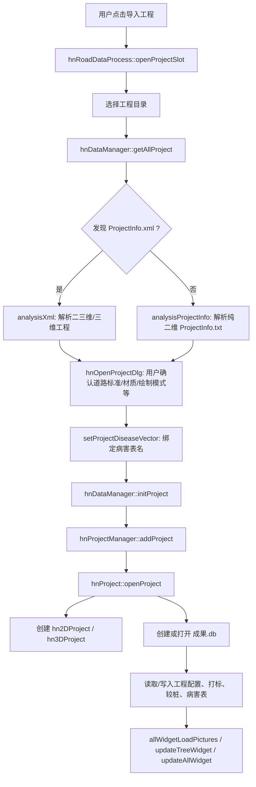
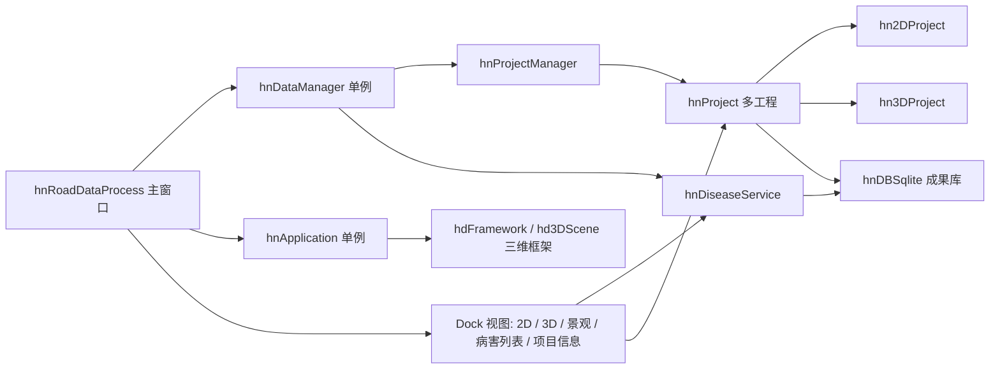

# hnRoadDataProcess 项目速读

本文档面向后续接手的开发者或 AI 助手，目标是通过一个入口文档快速理解项目结构、核心数据流和常见修改落点。本文重点覆盖 `hnRoadDataProcess`、`hnApplication`、`hnProject` 三个模块。

## 项目定位

`hnRoadDataProcess` 是一个 Windows 桌面端公路/道路检测数据处理软件，主体是 C++ + Qt + Visual Studio 多项目解决方案。它围绕二维路面影像、三维点云/深度影像、景观影像、道路病害、桩号/里程、成果数据库和报表/DXF 输出组织业务流程。

主要能力包括：

- 导入二维、三维、二三维一体化工程。
- 读取工程配置、道路规范参数、打标数据、较桩数据和影像/点云数据。
- 在二维路面影像、三维影像和景观视图中浏览、添加、删除、编辑、移动、合并病害。
- 支持人工模式、自动化模式、设计模式病害。
- 导入自动识别病害，合并/映射后写入成果库。
- 维护成果 SQLite 数据库，读写病害、工程配置、打标、较桩、控制点等数据。
- 计算 IRI/MTD/车辙等指标，输出 Excel 报表、DXF、控制点和国检转换中间数据。
- 支持高精度定位、百度地图轨迹展示、图片亮度/对比度调整、里程跳转和二三维里程校正。

## 技术栈和工程形态

- 语言：C++。
- UI：Qt 5.8.0，使用 Qt VS Tools 生成 `moc` / `uic` 文件。
- IDE/构建：Visual Studio，`PlatformToolset` 为 `v140`，平台主要是 `x64`。
- 主解决方案：`hnRoadDataProcess.sln`。
- 输出目录：各核心项目配置为 `..\bin\$(Configuration)-x64\`。
- 主要第三方/内部依赖：
  - Qt 模块：Core、Widgets、Gui、Network、WebEngine、WebChannel、WebView、Charts、AxContainer、PrintSupport 等。
  - SQLite：`3rd/SQLite`。
  - OpenCV 3.2.0：`3rd/opencv3.2.0`。
  - QXlsx：Excel 读写。
  - `hdFramework`、`hd3DScene`、`hd3DEngine`、`hdPointCloud` 等三维/点云框架。
  - `QtAdvancedDocking`、`hnQtRibbonUI` 提供停靠面板和 Ribbon UI。
  - `hnPavementCreate3d`、`HighAccConvertPlane`、`hnPcdCoordinate`、`hnCoordTranslate` 支撑三维影像、点云坐标和高精度定位。

## 重点目录

| 目录 | 角色 |
| --- | --- |
| `hnRoadDataProcess/` | 主程序 EXE。负责主窗口、Ribbon 菜单、Dock 视图、工程导入、功能入口、跨模块信号连接、报表/DXF/导入导出等编排。 |
| `hnApplication/` | 应用层 DLL。负责全局应用对象、二维/三维/景观视图控件、病害绘制/编辑/合并、病害缓存服务、视图工作模式和基础算法封装。 |
| `hnProject/` | 工程模型 DLL。负责打开工程、判断工程类型、初始化 `hn2DProject` / `hn3DProject`、维护成果库、里程/桩号/打标数据和工程配置。 |
| `hnCommon/` | 公共结构体和枚举，例如工程类型、作业模式、病害信息、工程配置、打标、较桩等。 |
| `hnDataTable/` | SQLite 表封装和数据读写接口。`hnProject` 和 `hnDiseaseService` 通过它操作成果库和道路参数库。 |
| `hnConfigService/` | 全局配置服务，核心是 `HnXRSettings` / `XRSetting.ini`。 |
| `hnLogService/` | 日志服务，主程序安装 Qt message handler 后写日志。 |
| `hnDxfIO/` | DXF 导出。 |
| `hnIO/`、`QXlsx/` | Excel/文件 IO。 |
| `hnAlgorithm/` | IRI、车辙、构造深度等算法入口。 |
| `3rd/` | 第三方库和头文件，体量很大，通常不应作为业务修改入口。 |

## 三个核心模块

### `hnRoadDataProcess`

这是最终应用程序项目，生成桌面 EXE。核心文件：

- `hnRoadDataProcess/main.cpp`
  - 设置进程 DPI、Qt 高 DPI、OpenGL 上下文共享和 OpenGLES。
  - 安装 `qInstallMessageHandler(logOutput)`，将 Qt 日志写入 `logMgr`。
  - 创建 `QApplication` 和 `hnRoadDataProcess` 主窗口。
  - 加载 `applicationDirPath()/config/blue.css`。
  - 内置 `HnRuntimeEventProbe`，输出 `[HN_PERF]` 启动、窗口事件和事件循环卡顿日志。
- `hnRoadDataProcess/hnRoadDataProcess.h/.cpp`
  - 继承 `hnRibbonMainWindow`。
  - 负责创建 Ribbon 分类、Dock 面板、二维/三维/景观/地图/病害列表/项目信息/IRM 曲线等视图。
  - 负责打开工程、最近工程、工程树、里程跳转、视图同步、病害模式切换、报表和 DXF 输出。
  - 通过 `hnDataManager` 访问当前工程，通过 `hnApplication::getApp()` 管理三维视图和工具。

主窗口初始化顺序：

1. 构造 `hnCenterToast`、`CDockManager`。
2. `createAction()` 创建 Ribbon 动作。
3. `initProject()` 读取配置并初始化道路规范参数。
4. `createView()` 创建停靠视图。
5. `initDlg()` 初始化可复用对话框。
6. `createConnect()` / `createTreeConnect()` 建立信号槽。
7. `initShortCuts()` 注册快捷键。
8. 显示状态栏、最大化、读取布局、设置图标。

常见功能入口：

| 功能 | 入口 |
| --- | --- |
| 打开工程 | `hnRoadDataProcess::openProjectSlot()` |
| 打开最近工程 | `hnRoadDataProcess::openLastProjectSlot()` |
| 工程树双击切换当前工程 | `hnRoadDataProcess::slot_dClickTreeItem()` |
| 加载配置 | `hnRoadDataProcess::loadConfigData()` |
| 创建视图 | `hnRoadDataProcess::createView()` |
| Ribbon 动作和连接 | `createAction()`、`createConnect()`、各 `create*Category()` |
| 添加/删除/编辑/移动/合并病害模式 | `slot_changeTo*DiseaseMode()` |
| 导入自动识别病害 | `slot_importAidcDiseases()` |
| 清空/更新病害 | `slot_clearAllDiseases()`、`slot_updateDiseaseDatabase()` |
| IRM 计算 | `slot_calculateIrm()`、`calculateIrmForm`、`CalculationThread` |
| 输出报表 | `slot_outputExcel()`、`hnOutputExcelDialog`、`hnOutExcelMileManage` |
| 导出 DXF | `slot_exportDXf()`、`slot_exportDiseaseDXf()` |
| 地图 | `CustomBaiduMapView` |
| 项目信息面板 | `projectView` |

### `hnApplication`

这是应用/视图/病害服务层，生成 DLL。它不直接显示主窗口，但提供主窗口需要的视图控件、全局应用对象和病害操作能力。

核心文件：

- `hnApplication/hnApplication.h/.cpp`
  - 单例 `hnApplication::getApp()`。
  - 继承 `CHdApp`，对接 `hdFramework` 三维框架。
  - 创建二维浏览控件、三维影像控件、三维点云视图、通用 `hnView`。
  - 管理当前三维工具、命令、活动视图、点云节点和三维窗口消息。
- `hnApplication/hnDataManager.h/.cpp`
  - 单例 `hnDataManager::getDataManager()`。
  - 项目层和 UI 层之间的主要门面。
  - 查找并解析工程：`ProjectInfo.xml`、`ProjectInfo.txt`。
  - 初始化道路规范参数：读取程序目录 `RoadParamDB/*.db`。
  - 维护当前 `hnProjectManager`、当前工程、工程打开状态、病害参数和道路类型参数。
  - 对外提供病害配置、道路等级/材质/绘制模式、高精度定位、深度计算、GPS/经纬度等服务。
- `hnApplication/hnDiseaseService.h/.cpp`
  - 当前工程病害缓存服务。
  - `setProject()` 切换工程并清缓存。
  - `ensureAllDiseaseCache()` 从成果库读取所有病害并排序。
  - `getRoadDiseasesInRange()` / `getStreetDiseaseInRange()` 为视图提供当前里程范围内病害。
  - `addDisease()`、`deleteOneDisease()`、`updateDisease()` 统一维护数据库和缓存，并发出 `diseaseAdded` / `diseaseDeleted` / `diseaseUpdated` / `diseaseReset` 信号。
- `hnApplication/hn2d3dPixBaseWidget.h/.cpp`
  - 二维/三维病害绘制控件的共同基类。
  - 组合继承 `hnBrowsePixWidget`、`hnWorkMode`、`hnFrameMode`、`hnMagnify`、`drawDiseases`、`rectAlgorithm`、`hnAdjustImage`、`depthCaculate`、`mergeDisease`、`lineAlgorithm`。
  - 统一处理工作模式、框选模式、线状病害、自动化小框、放大镜、右键拖拽删除、翻页续画和病害尺寸重算。
- `hnApplication/hn2dPixWidget.h/.cpp`
  - 二维路面影像视图。
  - 加载路面图片、绘制路面病害和打标信息。
  - 负责二维坐标、像素、编码器里程、真实桩号、二维/三维病害坐标互相映射。
- `hnApplication/hn3dPixWidget.h/.cpp`
  - 三维灰度/深度影像视图。
  - 加载三维影像、绘制三维病害和控制点。
  - 负责三维影像坐标、编码器里程、二维映射、控制点编辑、灰度/深度模式切换。
- `hnApplication/hnStreetCameraView.*`
  - 景观影像视图，处理景观病害浏览/绘制。
- `hnApplication/hnWorkMode.h`
  - 当前交互模式：无模式、添加、删除、编辑、移动、合并、取里程、添加控制点。
- `hnApplication/hnFrameMode.h`
  - 病害框选/绘制模式：人工大框、自动化小框、设计面状、设计线状。

### `hnProject`

这是工程数据模型层，生成 DLL。它负责把外业工程目录解析为可用的内业工程对象，并把工作副本写入成果库。

核心文件：

- `hnProject/hnProjectManager.h/.cpp`
  - 管理多个 `hnProject*`。
  - `addProject()` 批量创建并打开工程。
  - `setCurProject()` 根据工程名切换当前工程，并调用工程的 `setCurProject()`。
  - `initAllProjectMileVector()` 一次性初始化所有工程里程数据。
- `hnProject/hnProject.h/.cpp`
  - 单个工程的核心对象。
  - `openProject()` 判断 2D/3D/23D 工程类型，创建 `hn2DProject`、`hn3DProject`，创建或连接成果库。
  - 管理 `hnProjectSetInfo`、`hnMile`、`hnMarkInfo`、`hnMilePile`、当前二维/三维里程、成果库路径。
  - 提供编码器里程和真实桩号转换：`enclToTrueMile()`、`trueMileToEncl()`。
  - 维护打标和较桩：`changeMark()`、`addMark()`、`deleteMark()`、`changeMilePile()`、`addMilePile()`。
  - 维护成果库迁移：`import2DFieldDataToResultDb()`、`FieldSourceImported.flag`。
- `hnProject/hn2DProject.h/.cpp`
  - 二维工程数据。
  - 读取路面图片、景观图片、GPS、`Setting.ini`、`ProjectInfo.txt`、`CamSetting.ini`、`Dmi2Mile.txt`、`RoadStatuMarkInfo.txt` 等。
  - 保存二维采集参数：路面宽度、图片间距、设备类型、IRI/MTD/车辙路径、GPS 文件、景观标定等。
- `hnProject/hn3DProject.h/.cpp`
  - 三维工程数据。
  - 管理灰度图、深度图、相对/绝对点云路径、相机参数、影像索引和点云读取器。
  - 支持由影像名、像素坐标、GPS 时间、帧号、里程查找三维坐标或图片。

## 关键数据结构

集中在 `hnCommon/hnRoadTypeDef.h` 和 `hnCommon/hnRoadStruct.h`。

| 类型 | 含义 |
| --- | --- |
| `PROJECT_TYPE` | 工程类型：`PROJECT_2D_TYPE`、`PROJECT_XD_3D_TYPE`、`PROJECT_JD_3D_TYPE`、`PROJECT_23D_TYPE`。 |
| `ROAD_WORK_TYPE` | 作业/绘制模式：人工模式 `ROAD_WORK_LARGE_RECT`、自动化模式 `ROAD_WORK_SMALL_RECT`、设计模式 `DESIGN`。 |
| `ROAD_SURFACE_TYPE` | 路面材质：沥青、水泥、砂石。 |
| `hnProjectDataInfo` | 打开工程前的工程描述，来自 XML/TXT 和用户打开工程对话框补充设置。 |
| `hnProjectSetInfo` | 工程配置，包含道路名称、起终点桩号、编码器里程、行别、道路等级、规范、材质、绘制模式、图片比例等。 |
| `hnMilePile` | 较桩/里程桩校准数据，建立编码器里程和真实桩号关系。 |
| `hnMarkInfo` | 打标信息，例如材质、单元、等级、标准、路况等。 |
| `hnRoadDiseaseInfo` | 病害实例，包括里程、起终点、材质、绘制类型、等级、长宽面积深度、二维/三维坐标、GPS 时间、数据库表名等。 |
| `hnDiseaseSetInfo` | 病害参数配置，来自道路规范参数库，决定病害名称、表名、等级、材质、绘制模式、权重、有效面积/长度等。 |

## 工程打开流程

要点：

- `hnDataManager::getAllProject()` 先递归查找 `ProjectInfo.xml`，找到后按二三维/三维路径处理；否则查找 `ProjectInfo.txt`，按二维工程处理。
- `hnRoadDataProcess::openProjectSlot()` 会弹出 `hnOpenProjectDlg`，让用户确认/补充道路标准、材质、绘制模式、路宽、起终点等配置。
- `hnDataManager::setProjectDiseaseVector()` 会根据工程道路标准和绘制模式设置每个工程要读写的病害表。
- `hnProject::openProject()` 会根据目录存在性判断最终工程类型，然后初始化二维/三维子工程和成果库。
- 成果库默认位于工程结果目录中的 `成果.db`，具体路径由 `hnProject::getOrCreateResultDb()` 和 `getResultDB()` 决定。
- 对旧成果库，`FieldSourceImported.flag` 用来标记是否已经把外业 `Dmi2Mile.txt` / `RoadStatuMarkInfo.txt` 补入成果库工作副本。

## 运行时对象关系

## 病害数据流

### 浏览病害

1. 当前工程由 `hnDataManager::setCurrentProject()` / `hnProjectManager::setCurProject()` 设置。
2. `hnDataManager::getDiseaseService()->setProject(project)` 切换病害服务工程并清缓存。
3. 视图需要绘制时，调用 `hnDiseaseService::getRoadDiseasesInRange()` 或 `getStreetDiseaseInRange()`。
4. `hnDiseaseService::ensureAllDiseaseCache()` 首次从成果库读取所有病害并排序。
5. 视图按当前可见里程范围过滤病害并绘制。

### 添加/编辑/删除病害

1. 主窗口通过 `slot_changeToAddDiseaseMode()` / `slot_changeToEditDiseaseMode()` / `slot_changeToDeleteDiseaseMode()` 改变二维、三维、景观视图工作模式。
2. `hn2dPixWidget`、`hn3dPixWidget` 或景观视图响应鼠标事件。
3. 视图根据像素坐标计算编码器里程、真实桩号、二维/三维坐标、GPS 时间、面积/长度/宽度/深度等属性。
4. 通过 `hnDiseaseService` 或底层 `hnDBSqlite` 写入成果库。
5. 写入后发出病害变化信号，病害列表和影像视图刷新。

### 自动识别病害导入

1. 用户触发 `hnRoadDataProcess::slot_importAidcDiseases()`。
2. 仅支持人工模式或自动化模式，设计模式直接阻止。
3. 弹出 `hnMergeLittleFrameThresholdDlg` 获取横向/纵向合并阈值，以及是否合并、是否映射。
4. `hnImportAidcDiseases` 读取外部自动识别结果，转换为 `hnRoadDiseaseInfo`。
5. `mergeAidcDiseases`、`IsMergeableDisease`、`mergeTwoDiseases` 负责病害可合并判断和合并。
6. 转换/合并后的病害写入成果库，并触发视图刷新。

## 配置和数据位置

运行时依赖程序输出目录下的配置和数据文件：

- `config/blue.css`：主程序启动时加载的 QSS。
- `config/XRSetting.ini`：基础配置模板。首次运行或模板行数变化时，会复制到 `MyCommonMethods::GetUserPath()/XRSetting.ini`。
- `RoadParamDB/*.db`：道路规范参数库。`hnDataManager::initRoadStandardInfo()` 从这里读取道路类型参数和病害参数。
- 工程目录内常见输入：
  - `ProjectInfo.xml`：二三维/三维工程入口。
  - `ProjectInfo.txt`：纯二维工程入口。
  - `Setting.ini`：二维工程采集配置。
  - `CamSetting.ini`：二维相机/路宽等配置。
  - `Dmi2Mile.txt`：较桩/里程校准。
  - `RoadStatuMarkInfo.txt`：外业打标。
  - 路面图片、景观图片、灰度图、深度图、点云、相机参数等。
- 成果输出：
  - `成果.db`：成果 SQLite 数据库。
  - `FieldSourceImported.flag`：旧成果库外业数据补入标记。
  - Excel、DXF、控制点、国检中间数据等由用户选择输出路径或配置项控制。

## 常见修改落点

| 修改目标 | 优先查看 |
| --- | --- |
| 主界面按钮、菜单、Ribbon 分类 | `hnRoadDataProcess::createAction()`、`createConnect()`、`create*Category()` |
| 工程导入逻辑 | `hnRoadDataProcess::openProjectSlot()`、`hnDataManager::getAllProject()`、`hnOpenProjectDlg` |
| 工程类型判断和成果库初始化 | `hnProject::openProject()`、`getOrCreateResultDb()`、`getResultDB()` |
| 道路规范/病害参数读取 | `hnDataManager::initRoadStandardInfo()`、`RoadParamDB`、`hnDataTable` |
| 当前工程切换 | `hnProjectManager::setCurProject()`、`hnProject::setCurProject()`、`hnRoadDataProcess::slot_dClickTreeItem()` |
| 二维病害绘制/坐标计算 | `hn2dPixWidget`、`hn2d3dPixBaseWidget` |
| 三维病害绘制/控制点/坐标计算 | `hn3dPixWidget`、`hn3DProject` |
| 景观病害 | `hnStreetWidget`、`hnStreetCameraView`、`hnDiseaseService::getStreetDiseaseInRange()` |
| 病害缓存和增删改信号 | `hnDiseaseService` |
| 自动识别病害导入/合并 | `hnImportAidcDiseases`、`mergeAidcDiseases`、`IsMergeableDisease`、`mergeTwoDiseases` |
| 病害列表 | `hnDiseaseListWidget` |
| 项目信息/打标/较桩编辑 | `projectView`、`hnProject::changeMark()`、`hnProject::changeMilePile()` |
| 报表输出 | `slot_outputExcel()`、`hnOutputExcelDialog`、`hnOutExcelManage`、`hnOutExcelMileManage` |
| DXF 输出 | `slot_exportDXf()`、`slot_exportDiseaseDXf()`、`hnDxfIO` |
| IRM/IRI/MTD/车辙计算 | `calculateIrmForm`、`CalculationThread`、`hnAlgorithm` |
| 高精度定位 | `HighAccuracySettingForm`、`HighAccConvertPlane`、`hnDataManager::getDiseaseLoction()` |
| 日志和卡顿排查 | `main.cpp` 的 `logOutput`、`HnRuntimeEventProbe`、`hnLogService` |

## 构建和运行注意事项

1. 使用 `hnRoadDataProcess.sln` 打开解决方案。
2. 主要配置为 `Debug|x64` 和 `Release|x64`。
3. 工程文件使用 `QtInstall=QT5.8.0`，本机需要在 Visual Studio Qt VS Tools 中配置同名 Qt 版本，或调整 `.vcxproj` 中的 Qt 配置。
4. 工具集是 `v140`，通常对应 Visual Studio 2015 C++ 工具集。
5. 输出目录期望包含运行时配置：`config/`、`RoadParamDB/`、Qt DLL、内部 DLL、第三方 DLL 等。
6. 该仓库包含大量第三方库、生成目录和二进制文件；业务修改前先确认是否在源码目录，避免误改 `3rd/`、`bin/`、`Debug/`、`x64/`、`obj-x64/` 等输出/依赖目录。

## 开发排查建议

- 先看是否涉及当前工程生命周期。涉及工程打开、切换、成果库、里程、打标、较桩时，优先从 `hnProject` 和 `hnDataManager` 追。
- 涉及 UI 按钮或用户操作入口时，从 `hnRoadDataProcess::createConnect()` 找信号槽，再跳到对应 `slot_*`。
- 涉及病害显示不刷新时，检查 `hnDiseaseService` 缓存是否失效、是否发出 `diseaseChanged` / `diseaseReset`，以及二维/三维控件是否连接到这些信号。
- 涉及病害尺寸、坐标、里程错误时，先确认当前 `nDrawType`、工程类型、图片间距、路宽、像素比例和镜像配置，再看 `hn2dPixWidget` / `hn3dPixWidget` 的坐标转换函数。
- 涉及多工程报表时，注意 `slot_outputExcel()` 要求所有工程道路标准和绘制方式一致。
- 涉及旧工程成果库时，注意 `FieldSourceImported.flag` 和 `import2DFieldDataToResultDb()` 的迁移逻辑；不要同时覆盖外业原始文本和成果库工作副本，当前代码倾向于内业修改写成果库。
- 涉及中文乱码时，注意老代码和 `.ui` 文件可能不是统一 UTF-8 编码；修改前确认文件原始编码，避免造成大面积 diff。

## 建议的 AI 接手顺序

1. 明确用户要改的是“工程导入/成果库/病害交互/报表输出/算法计算/界面按钮”中的哪一类。
2. 用 `rg` 搜索对应 `slot_*`、类名或 UI 文案，先定位入口。
3. 从入口向下追到 `hnDataManager`、`hnProject`、`hnDiseaseService` 或具体视图类。
4. 修改前检查是否有同名逻辑同时存在于二维和三维视图，常见情况需要同时改 `hn2dPixWidget` 和 `hn3dPixWidget`。
5. 修改病害数据结构或数据库字段时，同时检查 `hnCommon/hnRoadStruct.h`、`hnDataTable`、报表输出和 DXF 输出。
6. 修改工程打开/配置读取时，同时检查二维 `ProjectInfo.txt`、二三维 `ProjectInfo.xml`、成果库已有/新建两条路径。
7. 修改后至少做静态验证：编译相关项目，打开工程，切换工程，浏览病害，新增/编辑/删除一个病害，检查成果库和视图刷新。

