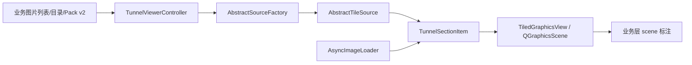

# TunnelViewerSDK

`TunnelViewerSDK` 是基于 Qt Graphics View 的连续影像浏览组件。它负责图片数据源加载、连续布局、缩放滚动、LOD、缓存和通用坐标转换，不负责公路病害类型、里程业务、数据库表、材质规则或报表。

本文基于 2026-07-14 当前代码。项目层接入方式见仓库根目录 [README.md](../README.md)。

## 1. 当前职责

SDK 当前负责：

- 将切片、普通单图或 Pack v2 图片包装为统一的 `AbstractTileSource`。
- 按水平、垂直及反向布局连续排列 `TunnelSectionItem`。
- 使用 `TiledGraphicsView` 提供滚动、缩放、定位和 scene 坐标。
- 使用 `AsyncImageLoader` 异步加载缩略图和高清数据。
- 提供图片局部坐标与全局 scene 坐标互转。
- 提供通用标注管理和 `GridSelectionTool` 网格选择算法。

SDK 不负责：

- 工程编码器里程与真实桩号换算。
- 2D/3D 里程差值和景观图联动。
- `hnRoadDiseaseInfo`、病害表名、病害等级和病害弹窗。
- 路面材质、标准、等级及跨材质校验。
- 病害数据库增删改查。

这些业务由 `hnApplication` 和 `hnRoadDataProcess` 的适配层承担。

## 2. 核心结构



| 类 | 主要职责 |
| --- | --- |
| `TunnelViewerController` | 加载目录、排好序的图片列表或 Pack v2；创建数据源并加入视图；清空当前路线。 |
| `TiledGraphicsView` | 管理 scene、连续布局、滚动缩放、可见图片更新、坐标转换和视图锚点。 |
| `TunnelSectionItem` | 表示一张连续图片/一个切片数据段，持有缩略图和当前加载块。 |
| `AbstractSourceFactory` | 把目录项或图片路径创建成 `AbstractTileSource`。 |
| `WholeImageSourceFactory` | 普通图片模式工厂，一张图片对应一个完整数据源。 |
| `PackImageTileSource` | Pack v2 中一帧图片的数据源适配。 |
| `AsyncImageLoader` | 异步读取缩略图、普通图片、数据库切片和 Pack 图片。 |
| `GridSelectionTool` | 根据物理网格执行点、矩形和折线选格。 |
| `DefectManager` | SDK 通用标注管理；不应写入公路项目的数据库规则。 |

## 3. 最小接入

### 3.1 普通图片列表

业务已经确定图片顺序时，应调用 `loadImages()`，避免 SDK 再扫描并猜测顺序。

```cpp
#include "src/TiledGraphicsView.h"
#include "src/TunnelViewerController.h"
#include "WholeImageSourceFactory.h"

auto* view = new TiledGraphicsView(parent);
auto* controller = new TunnelViewerController(view, parent);

controller->setSourceFactory(
    new WholeImageSourceFactory(
        LayoutOrientation::VerticalReverse,
        50,
        0,
        horizontalMirrored,
        verticalMirrored));

controller->loadImages(imagePaths);
```

`hnRoadDataProcess` 当前使用 `VerticalReverse`：第一张图在 scene 底部，路线向上延伸。水平/垂直翻转在数据源创建时传入，每一张图使用相同设置。

### 3.2 扫描目录

```cpp
controller->setSourceFactory(factory);
controller->loadRoute(rootPath);
```

扫描规则由 `AbstractSourceFactory::sourceFileFilters()` 和 `create()` 决定。

### 3.3 Pack v2

```cpp
PackRouteOptions options;
options.orientation = LayoutOrientation::Vertical;
options.scrollSpeed = 50;
options.verifyOnOpen = false;

if (!controller->loadPackRoute(packRoot, options)) {
    // 处理 PackIndex.idx 缺失或包读取失败。
}

const QList<PackRouteFrameInfo> frames = controller->packFrameInfos();
```

Pack v2 目录必须包含一个 `PackIndex.idx` 和若干 `Pack_*.dat`。当前入口不回退读取旧的分片索引格式。索引没有宽高，因此控制器只解码第一帧 JPEG 获取尺寸，并假定同包图片尺寸一致。

## 4. 坐标模型

SDK 中应区分三种坐标：

| 坐标 | 含义 | 典型 API |
| --- | --- | --- |
| viewport 坐标 | 鼠标相对 `TiledGraphicsView::viewport()` 的坐标 | `mapToScene()` / `mapFromScene()` |
| scene 坐标 | 整条连续路线的全局图形坐标 | `QGraphicsScene`、`focusOnPosition()` |
| 单图坐标 | 某张原始图片内的像素坐标 | `mapToGlobalScene()` / `GlobalSceneToMap()` |

单图点转换为 scene 点：

```cpp
QPointF scenePoint = view->mapToGlobalScene(imageName, localX, localY);
```

scene 点反查图片和单图像素：

```cpp
QString imageName;
int localX = 0;
int localY = 0;
bool ok = view->GlobalSceneToMap(scenePoint, imageName, localX, localY);
```

重要约束：

- `imageName` 必须能匹配 `TunnelSectionItem::getImageName()`。业务层应优先传 SDK 实际加载的完整路径或稳定 source key。
- `mapToGlobalScene()` 当前以 `QPointF(0, 0)` 作为部分失败/兜底结果，调用方不能仅凭返回类型判断成功；调试时必须同时检查图片名是否存在于 `m_items`。
- 图片名命中缓存 `m_imageItemCache` 只是一项优化。缓存为空不代表转换失败，首次调用会扫描 `m_items` 后再写入缓存。
- `clear()` 或重新加载路线后，图片名查询缓存会被清空。

### 4.1 视图锚点

`TiledViewAnchor` 包含：

- `imageName`
- `imageIndex`
- `scenePos`
- `imagePixelPos`
- `valid`

应用层常用 `currentBottomAnchor()` 获取当前底部中心对应的图片和单图点，再换算业务里程。程序定位可使用：

- `scrollToSceneY(sceneY)`
- `scrollToImagePixel(imageIndex, pixelY, anchorBottom)`
- `scrollToImagePixel(imageName, pixelY, anchorBottom)`
- `focusOnPosition(scenePos, targetScale)`

## 5. 图片缓存与预加载

缓存由两层组成：

| 位置 | 内容 |
| --- | --- |
| `AsyncImageLoader::m_thumbnailCache` | 全局缩略图缓存，当前上限约 500 MB。 |
| `AsyncImageLoader::m_cache` | 数据库/切片高清共享缓存，当前上限约 1000 MB。 |
| `TunnelSectionItem::m_loadedTiles` | 当前 item 已加载的高清块；普通整图模式主要保存在这里。 |
| `TunnelSectionItem::m_thumbnail` | 当前 item 的缩略图兜底。 |

普通单图 `WholeImage` 模式不会再把同一张高清整图复制到全局 `m_cache`，而是保存在对应 item 的 `m_loadedTiles`。数据库切片仍使用全局高清缓存。

当前整图预加载策略：

- 缩略图窗口约为当前视口前后 3 屏。
- 正常滚动时高清窗口约为前后 2 屏。
- 快速滚动时高清窗口缩小，远离窗口的 item 调用 `unloadAll()`。
- 高清未完成时由缩略图兜底，避免直接露出黑底。

这是受控滑动窗口，不是全工程图片常驻。调整内存时应先检查预加载窗口和 item 生命周期，不应直接把几十公里工程全量放入缓存。

## 6. 视图交互

SDK 默认支持方向键和 `W/A/S/D` 浏览、普通滚轮滚动、`Ctrl+滚轮` 缩放。业务层已有自己的快捷键体系时可关闭 SDK 键盘导航：

```cpp
view->setKeyboardNavigationEnabled(false);
```

在当前公路项目中：

- `D` 保留为 SDK 向右浏览。
- `R` 由业务层表示小框矩形选择模式。
- `B` 由业务层表示小框折线选择模式。
- 病害选择、提交和取消不属于 SDK 通用快捷键。

## 7. 网格选择

`GridSelectionTool` 只计算格子，不处理病害弹窗或数据库。

```cpp
PhysicalGridSpec spec;
spec.imageName = imageName;
spec.imagePixelSize = QSize(imageWidth, imageHeight);
spec.physicalSizeMeters = QSizeF(roadWidthMeters, imageLengthMeters);
spec.cellSizeMeters = QSizeF(0.1, 0.1);

GridCell cell = GridSelectionTool::cellForPoint(spec, point);
QVector<GridCell> byRect = GridSelectionTool::selectByRect(
    spec, rect, GridSelectionTool::FullyContained);
QVector<GridCell> byLine = GridSelectionTool::selectByPolyline(spec, points);
```

推荐的应用层策略：

- R 模式绘制阶段只显示外接矩形，确认时再生成最终格子。
- B 模式绘制阶段显示折线，确认时再做 supercover 补格。
- 大片密集格子正式显示时使用外接矩形或合并后的路径。
- 删除单格时根据鼠标的 `imageName + local pixel` 动态反查数据库格子，不要求 scene 中存在一个格子一个 item。

## 8. 标注边界

SDK 的 `AnnotationData`、`DefectData` 和 `DefectManager` 是通用能力。业务唯一键应作为不透明值传入，例如 `表名#ID`；SDK 不应解析表名、病害类型或数据库主键。

`hnRoadDataProcess` 当前的正式病害并不直接使用 SDK 内建公路病害模型，而是由应用层 `hnSdkDiseaseGraphicsLayer` 把业务 path 加到同一个 `QGraphicsScene`。这是刻意的边界：SDK 提供 scene 和坐标，应用层负责病害语义。

## 9. 常见问题

### 图片能看到，但业务标注 path 为空

按以下顺序检查：

1. 数据结构是否有几何点。
2. 几何点保存的图片 key/里程能否解析到 SDK 已加载的图片名。
3. `mapToGlobalScene()` 是否真正命中 `m_items`，而不是返回 `(0,0)` 兜底。
4. 四个点转换后是否仍构成非零宽高矩形。
5. path 是否被应用层可见范围过滤。

缓存为空通常不是根因。只有成功生成非空 path 后，应用层渲染缓存才会有内容。

### 滚动时黑底

检查：

- 图片源是否正确声明 `ImageSourceMode::WholeImage`。
- 缩略图请求是否成功。
- `updateVisibleTiles()` 是否被滚动事件调用。
- item 是否在进入预加载窗口前被错误 `unloadAll()`。
- 图片解码线程是否被大量病害 path 构建阻塞。

## 10. 构建

Visual Studio Debug x64：

```powershell
& "C:\Program Files\Microsoft Visual Studio\2022\Professional\MSBuild\Current\Bin\MSBuild.exe" `
  ..\hnRoadDataProcess.sln /t:TunnelViewerSDK `
  /p:Configuration=Debug /p:Platform=x64 /m /v:minimal
```

Qt/qmake 工程入口为 `SDK.pro`。修改源文件后要同步维护 `SDK.pro`、`TunnelViewerSDK.vcxproj` 和 `.filters`。

## 11. 开发约束

- SDK 核心不引入 `hnProject`、`hnRoadDiseaseInfo`、成果库或路面材质规则。
- 新数据源实现 `AbstractTileSource`，不要在 `TiledGraphicsView` 中硬编码项目文件格式。
- 图片名/source key 必须稳定，坐标转换和标注关联都依赖它。
- 复杂业务标注放到应用适配层，SDK 只提供通用 scene 能力。
- 任何缓存优化都必须保留明确的失效时机：重新加载、翻转变化、几何增删改后清理。
- 修改坐标公式时同时验证正向/反向布局、水平/垂直翻转和图片边界。
