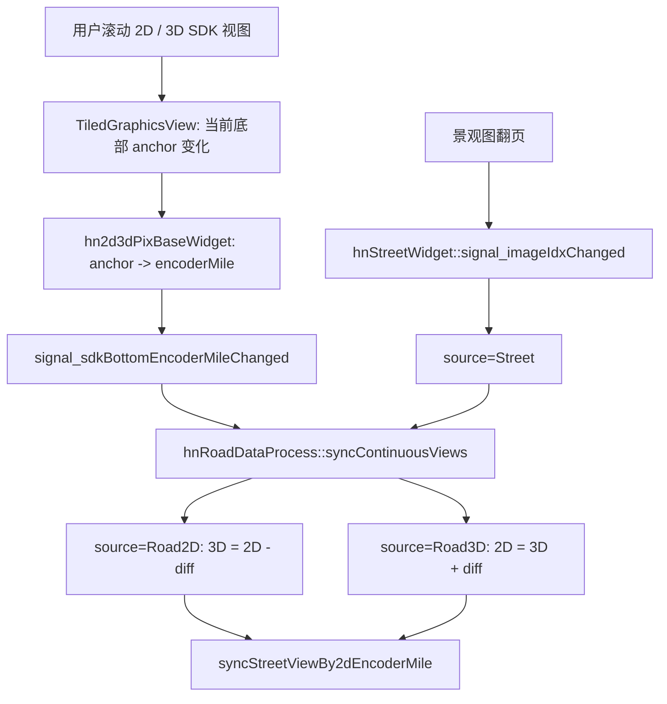

# 二维 / 三维 / 景观视图联动代码阅读指南

本文用于按顺序读懂当前视图代码结构，重点关注二维路面图、三维图、景观图之间如何加载、显示、定位和联动。

## 1. 先建立整体模型

当前视图联动可以先按三层理解：

1. 主窗口层：`hnRoadDataProcess`
   - 创建三个视图 dock。
   - 连接 2D、3D、景观图信号。
   - 统一处理 2D/3D/景观图联动。

2. 业务图像 widget 层：`hn2dPixWidget`、`hn3dPixWidget`、`hnStreetWidget`
   - 2D/3D 负责从工程数据取图片、里程比例、翻转设置。
   - 2D/3D 都继承同一个基类 `hn2d3dPixBaseWidget`。
   - 景观图单独由 `hnStreetWidget` 管理。

3. SDK 显示层：`TiledGraphicsView`
   - 真正负责连续图像显示、滚动、缩放、底部锚点。
   - SDK 不理解工程里程，只发 scene / anchor 信号。
   - 业务层把 SDK anchor 转成编码器里程。

最重要的一句话：**2D/3D 联动不是按鼠标点同步，而是按当前视图底部编码器里程同步。**

## 2. 第一步：看三个视图在哪里创建

先读 `hnRoadDataProcess::initDockWidget()` 附近。

文件：

- `hnRoadDataProcess/hnRoadDataProcess.cpp`

关键对象：

- `m_2dPixScrollWidget`
- `m_3dPixScrollWidget`
- `m_pStreetViewWidget`

创建关系：

```cpp
m_2dPixScrollWidget = hnApplication::getApp()->newRaodDamageContinousBrowserPixWidget();
m_3dPixScrollWidget = hnApplication::getApp()->new3DImageViewWidget();
m_pStreetViewWidget = new hnStreetWidget();
```

然后看 `hnApplication` 的工厂方法：

文件：

- `hnApplication/hnApplication.cpp`

关键方法：

```cpp
hnApplication::newRaodDamageContinousBrowserPixWidget()
hnApplication::new3DImageViewWidget()
```

这里会创建：

```cpp
hn2dPixScrollWidget -> hn2dPixWidget
hn3dPixScrollWidget -> hn3dPixWidget
```

阅读目标：

- 先确认主窗口持有的是 scroll widget。
- 真正画图和发 SDK 里程信号的是内部的 `getPixWidget()`。

## 3. 第二步：看 2D / 3D 图片怎么加载进 SDK

### 2D 加载入口

文件：

- `hnApplication/hn2dPixWidget.cpp`

关键方法：

```cpp
hn2dPixWidget::loadRoadPicture()
```

这段做四件事：

1. 从当前工程取 2D 工程。
2. 读取 2D 翻转设置。
3. 从 `getCurrentMileVector()` 收集路面图片路径。
4. 调用：

```cpp
loadPix(pixNames);
loadSdkVerticalImageSequence(pixNames);
setImageDistanceMeters(_RoadImgDis);
```

其中 `_RoadImgDis` 是二维单张路面图代表的实际米数。

### 3D 加载入口

文件：

- `hnApplication/hn3dPixWidget.cpp`

关键方法：

```cpp
hn3dPixWidget::load3DImagePictures()
```

这段做的事情类似：

1. 从当前工程取 3D 工程。
2. 读取 3D 翻转设置。
3. 根据灰度 / 深度模式组装图片路径。
4. 调用：

```cpp
loadPix(pixNames);
loadSdkVerticalImageSequence(pixNames);
setImageDistanceMeters(m_3dImageDistanceMeters);
```

当前 3D 默认单张图片里程来自 `m_3dImageDistanceMeters`。

### 共同 SDK 加载入口

文件：

- `hnApplication/hn2d3dPixBaseWidget.cpp`

关键方法：

```cpp
hn2d3dPixBaseWidget::loadSdkVerticalImageSequence()
```

这里会创建 / 复用：

```cpp
TiledGraphicsView
TunnelViewerController
WholeImageSourceFactory
```

阅读目标：

- 2D/3D 图片最终都进入同一个 SDK 显示组件。
- 2D/3D 的差异主要在图片来源、单张图代表米数、翻转设置、状态栏生成逻辑。

## 4. 第三步：看 SDK 如何告诉业务层“当前滚到哪里”

文件：

- `SDK/src/TiledGraphicsView.cpp`
- `SDK/src/TiledGraphicsView.h`

关键方法：

```cpp
TiledGraphicsView::emitViewCenterChanged()
TiledGraphicsView::emitUserViewBottomAnchorChanged()
```

关键 SDK 信号：

```cpp
sigViewBottomAnchorChanged(TiledViewAnchor anchor)
sigUserViewBottomAnchorChanged(TiledViewAnchor anchor)
```

当前主同步主要依赖 `sigViewBottomAnchorChanged` 这条链路。原因是它表示实际底部锚点变化，比 user-only 信号更完整。

SDK anchor 本身包含：

- 当前图片名
- 当前图片内像素点
- scene 坐标
- valid 标志

SDK 不知道“桩号”“真实里程”“二三维差值”，这些都在业务层计算。

## 5. 第四步：看业务层如何把 SDK anchor 转成编码器里程

文件：

- `hnApplication/hn2d3dPixBaseWidget.cpp`

关键连接在：

```cpp
hn2d3dPixBaseWidget::ensureSdkImageView()
```

关键代码形态：

```cpp
connect(m_sdkImageView, &TiledGraphicsView::sigViewBottomAnchorChanged, ...);
```

这个连接里会做：

```cpp
const double encoderMile = sdkAnchorToEncoderMile(anchor);
syncLegacyBrowseStateFromEncoderMile(encoderMile);
emit signal_sdkBottomEncoderMileChanged(encoderMile);
refreshStatusInfoFromSdkCurrentMouseOrAnchor(anchor);
```

关键方法：

```cpp
sdkAnchorToEncoderMile()
sdkPixPointToEncoderMile()
scrollBottomToEncoderMile()
currentBottomEncoderMile()
```

编码器里程计算核心语义：

```text
图片序号 + 图片内 y 坐标 + 单张图片代表米数 -> 编码器里程
```

注意：

- 这里的里程是编码器里程，不是桩号。
- 真正显示桩号时才会通过工程转换成真实里程 / 桩号。

## 6. 第五步：看主窗口如何统一联动

文件：

- `hnRoadDataProcess/hnRoadDataProcess.cpp`
- `hnRoadDataProcess/hnRoadDataProcess.h`

先看声明：

```cpp
enum class ContinuousViewSyncSource
{
    Road2D,
    Road3D,
    Street
};

void syncContinuousViews(ContinuousViewSyncSource source, double sourceEncoderMile);
```

再看连接：

```cpp
connect(2dPixWidget, &hn2dPixWidget::signal_sdkBottomEncoderMileChanged, ...);
connect(3dPixWidget, &hn3dPixWidget::signal_sdkBottomEncoderMileChanged, ...);
connect(streetWidget, &hnStreetWidget::signal_imageIdxChanged, ...);
```

当前联动统一进：

```cpp
hnRoadDataProcess::syncContinuousViews()
```

这个函数是当前读联动逻辑最重要的地方。

## 7. 2D 滚动时发生什么

链路：

```text
用户滚动 2D SDK 视图
-> TiledGraphicsView 发 sigViewBottomAnchorChanged
-> hn2d3dPixBaseWidget 转成 encoderMile
-> hn2dPixWidget 发 signal_sdkBottomEncoderMileChanged
-> hnRoadDataProcess::syncContinuousViews(Road2D, sourceMile)
```

同步公式：

```cpp
target3dMile = source2dMile - project->get2d3dMileDiff();
```

然后：

```cpp
m_3dPixScrollWidget->getPixWidget()->scrollBottomToEncoderMile(target3dMile);
syncStreetViewBy2dEncoderMile(source2dMile);
```

意思是：

- 2D 是源。
- 3D 跟着 2D 的里程差走。
- 景观图按 2D 编码器里程更新。

## 8. 3D 滚动时发生什么

链路：

```text
用户滚动 3D SDK 视图
-> TiledGraphicsView 发 sigViewBottomAnchorChanged
-> hn2d3dPixBaseWidget 转成 encoderMile
-> hn3dPixWidget 发 signal_sdkBottomEncoderMileChanged
-> hnRoadDataProcess::syncContinuousViews(Road3D, sourceMile)
```

同步公式：

```cpp
target2dMile = source3dMile + project->get2d3dMileDiff();
```

然后：

```cpp
m_2dPixScrollWidget->getPixWidget()->scrollBottomToEncoderMile(target2dMile);
syncStreetViewBy2dEncoderMile(target2dMile);
```

意思是：

- 3D 是源。
- 2D 按差值反推。
- 景观图仍然跟 2D 里程走。

## 9. 景观图翻页时发生什么

文件：

- `hnRoadDataProcess/hnStreetWidget.cpp`

关键方法：

```cpp
hnStreetWidget::updateViewImage(int nIndex)
```

这个方法更新左右景观图后发：

```cpp
emit signal_imageIdxChanged(nIndex);
```

主窗口接到后进入：

```cpp
hnRoadDataProcess::slot_streetWidgetFrameIdxChanged()
```

再调用：

```cpp
syncContinuousViews(ContinuousViewSyncSource::Street, qMax(0, streetFrameIdx));
```

当前代码里注释说明：景观图信号传出来的是行驶距离，直接作为 2D 编码器里程使用。

同步逻辑：

```text
Street sourceMile
-> 2D scrollBottomToEncoderMile(sourceMile)
-> 3D scrollBottomToEncoderMile(sourceMile - diff)
```

## 10. 二三维里程校准怎么影响联动

入口在主窗口热键：

文件：

- `hnRoadDataProcess/hnRoadDataProcess.cpp`

关键逻辑：

```cpp
Shift + C
```

当前差值定义：

```cpp
diff = selected2dMile - selected3dMile;
currentProject->set2d3dMileDiff(diff);
```

所以 `2D3D_DIFF` 是编码器里程差，不是像素差。

校准后：

```cpp
source2dMile = currentBottomEncoderMile();
syncContinuousViews(Road2D, source2dMile);
```

意思是：

- 校准点只用来计算差值。
- 成功后以当前 2D 底部里程为基准刷新 3D。
- 后续所有联动都继续使用这个差值。

## 11. 重要变量和概念

### 编码器里程

代码里常叫：

```cpp
encoderMile
dEnclMile
dDmi
```

这是联动的主坐标。

### 真实里程 / 桩号

通常通过工程转换：

```cpp
project->enclToTrueMile()
project->trueMileToEncl()
```

状态栏显示桩号时才需要关注它。

### 2D3D_DIFF

读取：

```cpp
project->get2d3dMileDiff()
```

保存：

```cpp
project->set2d3dMileDiff(diff)
```

语义：

```text
2D3D_DIFF = 2D 编码器里程 - 3D 编码器里程
```

不是像素差。

### source

`ContinuousViewSyncSource` 表示当前是谁主动变化：

- `Road2D`：二维视图是源。
- `Road3D`：三维视图是源。
- `Street`：景观图是源。

## 12. 推荐阅读顺序

按下面顺序读，不容易绕进去：

1. `hnRoadDataProcess::initDockWidget()`
   - 看 2D、3D、景观图对象怎么创建。

2. `hnApplication::newRaodDamageContinousBrowserPixWidget()`
   - 看 2D scroll widget 和 2D pix widget 的关系。

3. `hnApplication::new3DImageViewWidget()`
   - 看 3D scroll widget 和 3D pix widget 的关系。

4. `hn2dPixWidget::loadRoadPicture()`
   - 看 2D 图片和 `_RoadImgDis` 怎么喂给 SDK。

5. `hn3dPixWidget::load3DImagePictures()`
   - 看 3D 图片和 `m_3dImageDistanceMeters` 怎么喂给 SDK。

6. `hn2d3dPixBaseWidget::ensureSdkImageView()`
   - 看 SDK 信号如何转成业务信号。

7. `TiledGraphicsView::emitViewCenterChanged()`
   - 看 SDK 底部 anchor 信号从哪里发出。

8. `hnRoadDataProcess::createConnect()`
   - 看 2D/3D/景观图信号接到哪里。

9. `hnRoadDataProcess::syncContinuousViews()`
   - 看真正联动公式和目标视图滚动。

10. `hnStreetWidget::updateViewImage()`
   - 看景观图翻页如何反向影响 2D/3D。

11. `Shift+C` 热键逻辑
   - 看校准如何改变 `2D3D_DIFF`。

## 13. 调试联动不动时先看哪里

如果 2D 滚动时 3D 不动，先在这些地方打日志：

### 1. SDK 是否发出了底部锚点

文件：

- `hnApplication/hn2d3dPixBaseWidget.cpp`

位置：

```cpp
sigViewBottomAnchorChanged lambda
```

打印：

```cpp
qDebug() << "bottom anchor" << objectName() << encoderMile;
```

### 2. 主窗口是否收到 2D/3D 信号

文件：

- `hnRoadDataProcess/hnRoadDataProcess.cpp`

位置：

```cpp
signal_sdkBottomEncoderMileChanged connect lambda
```

打印：

```cpp
qDebug() << "sync signal 2d" << source2dMile;
qDebug() << "sync signal 3d" << source3dMile;
```

### 3. `syncContinuousViews()` 是否被挡掉

检查：

```cpp
m_isProgrammaticViewSync
dataManager->isOpenProject()
project->get2DProject()
project->get3DProject()
```

如果 `m_isProgrammaticViewSync` 一直是 true，说明程序同步保护没有恢复。

### 4. 目标里程是否算错

在 `syncContinuousViews()` 里打印：

```cpp
qDebug() << "source" << int(source)
         << "sourceMile" << sourceMile
         << "diff" << project->get2d3dMileDiff()
         << "target";
```

### 5. 目标视图是否响应滚动

文件：

- `hnApplication/hn2d3dPixBaseWidget.cpp`

位置：

```cpp
scrollBottomToEncoderMile()
setSdkBottomEncoderMile()
```

看目标图片名、图片序号、pixelY 是否有效。

## 14. 当前代码的关键注意点

1. 主同步入口现在是 `signal_sdkBottomEncoderMileChanged`，不是 user-only 信号。
   - user-only 信号适合表达“用户主动浏览”，但容易漏掉某些路径。
   - bottom 信号表示实际视图位置变化，更适合作统一同步源。

2. 防回环靠 `m_isProgrammaticViewSync`。
   - 程序同步 3D 时，3D 也会发 bottom 信号。
   - 这个 flag 用来避免 3D 立刻反向同步 2D。

3. 景观图由 2D 里程驱动。
   - 2D 源：直接用 2D 编码器里程更新景观。
   - 3D 源：先转成 2D 里程，再更新景观。
   - 景观源：直接定位 2D，再按差值定位 3D。

4. 2D/3D 差值是编码器里程差。
   - 不要把它当像素差。
   - 需要像素差时，各自视图按自己的图片高度和单张图里程临时换算。

5. SDK 负责显示，不负责业务里程。
   - 任何桩号、路面标准、景观图名、工程信息都应该在业务层生成。

## 15. 一张简化流程图



## 16. 最小阅读目标

如果只是为了读懂联动，先不用读病害绘制、状态栏、导出、点云大视图。最低限度读这 6 个位置：

1. `hnRoadDataProcess::createConnect()`
2. `hnRoadDataProcess::syncContinuousViews()`
3. `hn2d3dPixBaseWidget::ensureSdkImageView()`
4. `hn2d3dPixBaseWidget::scrollBottomToEncoderMile()`
5. `hn2dPixWidget::loadRoadPicture()`
6. `hn3dPixWidget::load3DImagePictures()`

读完这 6 个位置，二维、三维、景观图联动的主干就能串起来。
